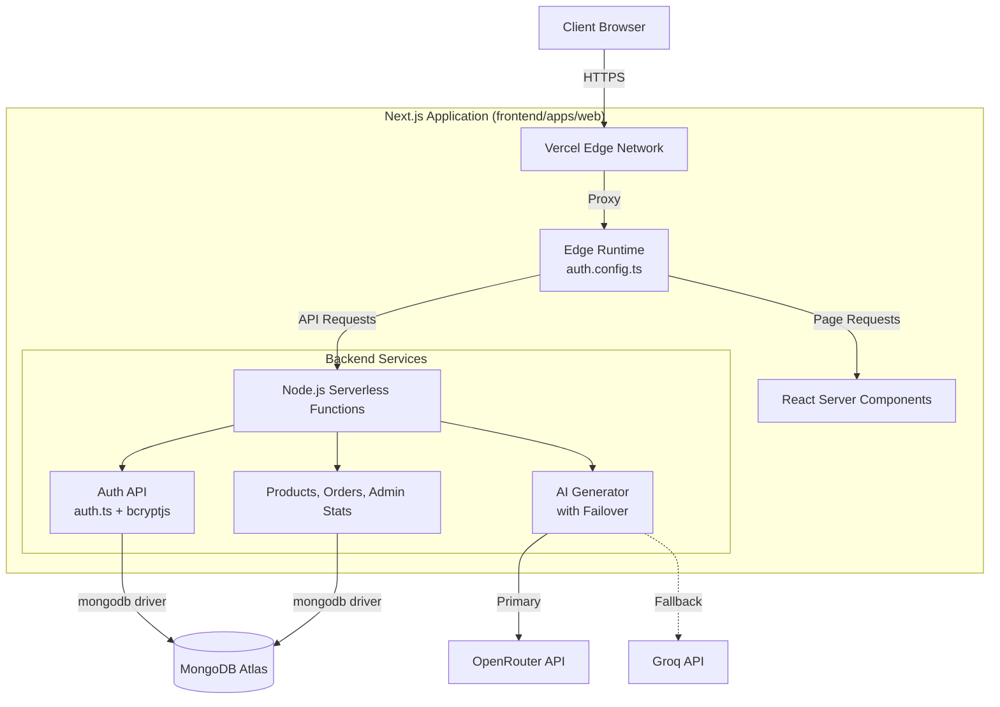

# ModernMart 🛒
### Next-Gen AI-Assisted Grocery E-Commerce Platform

[](#)
[](https://nextjs.org/)
[](https://react.dev/)
[](https://turbo.build/)

**ModernMart** is a sophisticated e-commerce solution that leverages Artificial Intelligence to revolutionize the grocery shopping experience. Built with a focus on performance, scalability, and type safety, it demonstrates modern full-stack engineering patterns using the Next.js 16 App Router and React 19.

[Demo](#demo) | [Screenshots](#screenshots) | [Tech Stack](#tech-stack) | [Engineering Highlights](#engineering-highlights)

---

## 🚀 Engineering Highlights

- **Multi-Provider AI Resilience:** Implements a dynamic failover strategy for AI services. If the primary provider (OpenRouter) is unavailable, the system automatically rotates through Groq, ensuring the AI Shopping Assistant remains functional.
- **End-to-End Type Safety:** Leverages TypeScript across the entire monorepo, including shared packages and API contracts, minimizing runtime errors and improving developer velocity.
- **Modern React Architecture:** Utilizes React 19 and Next.js 16 features, including React Server Components (RSC) for optimized data fetching and improved performance.
- **Scalable Monorepo Design:** Managed with Turborepo to enable efficient builds, shared UI components, and standardized configurations across the workspace.
- **Robust Security:** Implements Role-Based Access Control (RBAC) via Auth.js (NextAuth v5), protecting sensitive admin routes and user data.
- **Comprehensive Testing:** Unit and integration testing with Vitest and E2E testing with Playwright, ensuring critical paths like "Add to Cart" and "Order Flow" are reliable.

---

## 🏗️ Architecture



---

## ✨ Features

### 🛒 Customer Experience
- **AI-Powered Shopping Assistant:** Generate instant grocery lists from natural language prompts (e.g., "Ingredients for Butter Chicken for 4 people").
- **Smart Product Discovery:** Seamlessly browse categorized products with real-time search and filtering.
- **Unified Checkout:** Secure payment flow supporting both Cash on Delivery (COD) and online payments.
- **Interactive UI:** Micro-animations and responsive design built with Tailwind CSS 4 and Framer Motion.
- **Engagement:** Product reviews and ratings system to drive social proof and customer feedback.

### 🛡️ Admin Management
- **Centralized Dashboard:** Real-time visibility into daily sales, order volume, and revenue metrics.
- **Inventory Control:** Full CRUD operations for product management with image upload capabilities.
- **Order Fulfillment:** Streamlined order tracking system from placement to 'Delivered' status.

---

## 🛠️ Tech Stack

### Frontend & Core
- **Next.js 16:** App Router, Server Actions, and Turbopack.
- **React 19:** Functional components with Hooks and Server Components.
- **Tailwind CSS 4:** Utility-first styling with modern CSS features.
- **Zustand:** Lightweight state management for cart and UI state.
- **Framer Motion:** High-performance animations for a polished UX.

### Backend & AI
- **Node.js:** Server-side logic within Next.js API Routes.
- **MongoDB:** Scalable NoSQL database with Mongoose ODM.
- **Auth.js (v5):** Secure, flexible authentication and session management.
- **LLM Integration:** Llama 3.1 via OpenRouter and Groq for intelligent processing.

### Tooling & DevOps
- **Turborepo:** Optimized monorepo orchestration.
- **Vitest & Playwright:** Modern testing stack for unit and E2E coverage.
- **Zod:** Schema validation for API requests and environment variables.
- **ESLint & Prettier:** Standardized code quality and formatting.

---

## 📸 Screenshots

### Storefront


### AI Shopping Assistant


### Admin Panel


---

## 🚦 Getting Started

### Prerequisites
- Node.js 20+
- npm 10+
- A MongoDB database (Local or Atlas)

### 1. Install Dependencies
From the repo root:
```bash
cd frontend
npm install
```

### 2. Environment Configuration
Copy the template in `frontend/apps/web`:
```bash
cd apps/web
cp .env.example .env.local
```
Minimum required: `MONGODB_URI`, `NEXTAUTH_SECRET`, `NEXTAUTH_URL`.

### 3. Run Locally
```bash
# From frontend directory
npm run dev
```
The app runs on `http://localhost:3000`.

### 4. Admin Bootstrap
To create the first admin account:
```bash
cd apps/web
npm run seed:admin
```
*Credentials: admin@gmail.com / admin123*

---

## 🧪 Testing
```bash
# Run all tests via Turbo
npm run test

# Run specific app tests
cd frontend/apps/web
npm run test           # Vitest
npm run test:e2e       # Playwright
```

---

## 🌐 Deployment
Deploy the Next.js app to Vercel:
- Root directory: `frontend/apps/web`
- Node version: 20+
- Environment variables: See `.env.example`
